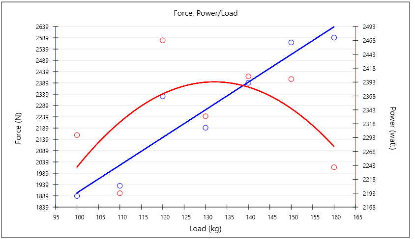

## MulitAxisScatterChart

Implementation of 2 Y-Axis Scatter Chart in pure JavaFX. This project was created due to lack of JavaFX default charts to represent data in multiple Y-Axis.

Additional Functionalities:
Display Polynomial or Linear regression (TrendLines). ( Using <url>http://thorwin.nl/</url> for calculating line/curves coefficients )


## Code Example

Creating a new chart:

```java
// new CustomAxis(minValue, maxValue, tickValue)
CustomAxis xAxis = new CustomAxis(0, 1, 0.1);
xAxis.setTitle("Load (kg)");

CustomAxis y1Axis = new CustomAxis(0, 3000, 500);
y1Axis.setTitle("Force (N)");

CustomAxis y2Axis = new CustomAxis(2150, 2500, 50);
y2Axis.setTitle("Power (watt)");

// new MultiAxisScatterChart(width, height , . . . );
MultiAxisScatterChart chart = new MultiAxisScatterChart(850, 500, xAxis, y1Axis, y2Axis);
chart.setTitle("Force, Power/Load");
```


Adding value to a chart:

```java

// addValue arguments (xValue , yValue, axisIndex)

// Adding value on chart on Second Y Axis
chart.addValue(100, 1889,MultiAxisScatterChart.FIRST_Y_AXIS);
chart.addValue(110, 1935,MultiAxisScatterChart.FIRST_Y_AXIS);
chart.addValue(120, 2337,MultiAxisScatterChart.FIRST_Y_AXIS);
chart.addValue(130, 2196,MultiAxisScatterChart.FIRST_Y_AXIS);
chart.addValue(140, 2398,MultiAxisScatterChart.FIRST_Y_AXIS);
chart.addValue(150, 2579,MultiAxisScatterChart.FIRST_Y_AXIS);
chart.addValue(160, 2601,MultiAxisScatterChart.FIRST_Y_AXIS);

// Adding value on chart on Second Y Axis
chart.addValue(100, 2298,MultiAxisScatterChart.SECOND_Y_AXIS);
chart.addValue(110, 2193,MultiAxisScatterChart.SECOND_Y_AXIS);
chart.addValue(120, 2469,MultiAxisScatterChart.SECOND_Y_AXIS);
chart.addValue(130, 2332,MultiAxisScatterChart.SECOND_Y_AXIS);
chart.addValue(140, 2404,MultiAxisScatterChart.SECOND_Y_AXIS);
chart.addValue(150, 2399,MultiAxisScatterChart.SECOND_Y_AXIS);
chart.addValue(160, 2240,MultiAxisScatterChart.SECOND_Y_AXIS);
```


Display Polynomial or Linear regression. By default, regressions are not activated.

```java
chart.showLinearTrendLineOnAxis(MultiAxisScatterChart.FIRST_Y_AXIS);
chart.showPolynomialTrendLineOnAxis(MultiAxisScatterChart.SECOND_Y_AXIS);
```




## Importand Notes 

By default, the chart will be auto-scaled which means that adding values will change the scaling of all axis to a recommended minValue, maxValue and tickValue. You can disable this by adding:

```java
xAxis.setAutoScaling(false);

y1Axis.setAutoScaling(false);

y2Axis.setAutoScaling(false);
```

This will give you the opportunity to select which axis will be auto-scaled and which is not. 

Each time a new value is set to the chart those steps are taking place:

1. Adding the actual value and getting ready to draw it ( it will not be drawn yet )
2. Program checks if all axis are auto scalable and if they are then rescaled them depending the user value 
  2.1 If there is a chance in scaling on an axis then the new Labels will be created for this axis
3. Program will check if there was any change in scaling and if there was it will draw all the Axis again 
4. If Trendlines are activated, it will set the new trendlines points ( it will not be drawn yet )
5. read below 


In addition, the chart is auto updated which means that by adding just one value the step 5 will be:

5. if the chart is auto updated then it will remove all the points from the chart and it will redraw every and each one of them plus the new one, in the updated axis (  + the trendlines (points) if they are activated )

The last step needs a lot of calculations when the trendlines are activated and so to improve programs execution you can make the chart to not update automatically by adding:

```java
chart.setAutoUpdate(false);
```

Keep in mind that you will have to call ``` chart.updateValues();``` every time you wish to update the chart

## Licence
-------
[GNU GENERAL PUBLIC LICENSE](LICENSE)
